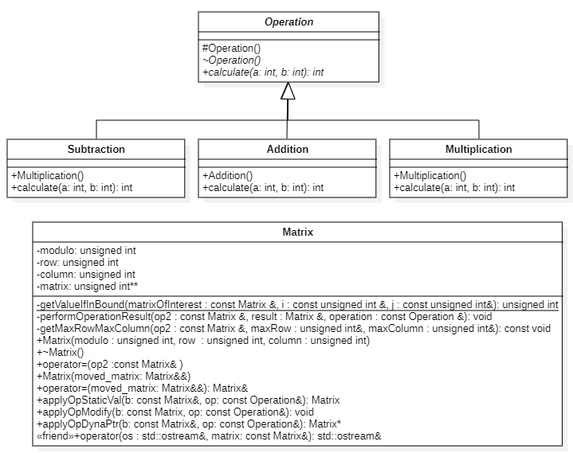

---
graphics: true
geometry: true
lang: "fr"
toc: true
toc-own-page: true
colorlinks: true
custom-title-page: true
custom-title-page-logo: logo.pdf
custom-title-page-logo-size: 25mm
title: "POA - Laboratoire 1"
subtitle: "Matrix Reloaded"
author:
  - REDACTED
  - Quentin Surdez
linestretch: 1.3
numbersections: true 
header-left: "\\headerlogo"
fontsize: 11pt
...

# Rapport

authors : REDACTED, Quentin Surdez


## Introduction
Dans ce laboratoire, nous avons implémenté une matrix et ses opérations en c++. Nous
explorons également la manière la plus efficace d'effectuer les dites opérations sur 
les matrices.

## Détails de compilation


| Compilateur | Version minimum |
|-------------|-----------------|
| Apple clang | 15.0.0          |

### Instructions de compilation

```shell
mkdir build
cd build
cmake .. -G "Unix Makefiles"
make # build avec make
```

## Choix d'implémentation

### Un seul constructeur
Nous avons décidé d'utiliser un seul constructeur qui est le constructeur qui prend 
les tailles des lignes, colonnes, modulo en paramètre puis génère une matrice remplie de 
nombres aléatoires ayant la bonne taille. En effet, nous appelons également ce 
constructeur lorsque nous voulons avoir la matrice résultante d'une opération. 
Nous avons fait ce choix car nous devrions dans tous les cas initialiser une matrice
avec des éléments à 0 et nous devrions en tous les cas réécrire ces éléments avec les
bonnes valeurs. La complexité de ce constructeur est en O(lignes*colonnes) et resterait
la même avec un deuxième constructeur.

### Modulo fait maison
Afin d'éviter des overflows en utilisant des entiers non-signés nous avons réimplémenté
un modulo fonctionnant avec des entiers signés pour performer les opérations.
Nous nous sommes basés sur notre utilisation de la fonction `Math.floormod()` de Java
afin d'implémenter son équivalent dans le langage c++.

## Analyse des implémentation des opérations
Notons d'abord que toutes ces implémentation font le même nombre d'opérations et ont
donc la même complexité en O(maxRows*maxCol). Les différences se situent au niveau
de la mémoire et nous allons les analyser pour chaque cas de figure.

### Static par valeur
Nous devons retourner cette matrice par valeur et non par référence car nous ne sommes
pas sensé savoir de quelle taille sera la matrice retournée. Cela néccésiterait des 
considérations particulière du code appelant qui devrait adapter son initialisation
de la matrice par référence à la taille de la matrice résultante de l'opération. Ou 
alors il faudrait réallouer de la mémoire dans le code de la fonction effectuant 
l'opération. Nous prendrions des risques de fuites de mémoire ou de mauvaise utilisation
de notre classe. 

| Avantages                                                                                               | Inconvénients                                                                                        |
|---------------------------------------------------------------------------------------------------------|------------------------------------------------------------------------------------------------------|
| **Efficacité** : L'allocation statique de mémoire pour la matrice peut être plus efficace en termes de mémoire et de performances. En effet, La mémoire allouée statiquement est généralement plus rapide à accéder et ne nécessite pas les surcoûts de l'allocation et de la désallocation de mémoire. | **Taille fixe** : La mémoire allouée statiquement a une taille fixe déterminée à la compilation. Cela signifie que la taille de la matrice doit être connue à l'avance et ne peut pas être redimensionnée dynamiquement pendant l'exécution. |
| **Simplicité** : L'allocation statique de mémoire simplifie la gestion de la mémoire. Il n'est pas nécessaire de se soucier de désallouer explicitement la mémoire, car la mémoire est automatiquement désallouée lorsque la variable sort de la portée. | **Limitations de la taille de la pile** : La mémoire allouée statiquement est allouée sur la pile. S'il y a des limitation de la mémoire de la pile, Les grandes matrices dont les dimensions sont déterminées à l'exécution peuvent dépasser ces limitations, entraînant des erreurs de débordement de pile. |


### Allocation dynamique 
| Avantages                                                                                                          | Inconvénients                                                                                                        |
|--------------------------------------------------------------------------------------------------------------------|----------------------------------------------------------------------------------------------------------------------|
| **Flexibilité de la taille** : L'allocation dynamique de mémoire permet de créer des matrices de taille variable, ce qui est utile lorsque la taille de la matrice doit être déterminée dynamiquement pendant l'exécution. La taille de la matrice peut également être redimensionnée dynamiquement pendant l'exécuition.| **Gestion de la mémoire requise** : L'allocation dynamique de mémoire nécessite une gestion manuelle de la mémoire, ce qui peut entraîner des fuites de mémoire si la désallocation appropriée n'est pas effectuée. |
| **Utilisation efficace de la mémoire** : La mémoire est allouée uniquement lorsque cela est nécessaire, ce qui évite la réservation inutile de mémoire pour une matrice dont la taille n'est pas connue à l'avance. | **Performances** : L'allocation et la désallocation dynamiques de mémoire peuvent entraîner un surcoût de performances par rapport à l'allocation statique, en raison de la gestion supplémentaire de la mémoire effectuée par le système d'exploitation. L'allocation dynamique de mémoire peut conduire à la fragmentation de la mémoire, ce qui peut réduire l'efficacité de l'utilisation de la mémoire. |


### Modification de la matrice courante
| Avantages                                                                                                                                                                                                                         | Inconvénients                                                                                          |
|-----------------------------------------------------------------------------------------------------------------------------------------------------------------------------------------------------------------------------------|--------------------------------------------------------------------------------------------------------|
| **Utilisation efficace de la mémoire** : La fonction modifie la matrice existante sans créer de nouvelle instance, ce qui évite l'allocation de mémoire supplémentaire. Nous économisons donc des ressources de mémoire et temps. | **Potentiel de fuites de mémoire** : Si la désallocation de la mémoire n'est pas correctement gérée à l'intérieur de la fonction, cela peut entraîner des fuites de mémoire. |
| **Utilisation efficace du temps** : La fonction évite les opérations de copie coûteuses associées à la création d'une nouvelle matrice, ce qui peut améliorer les performances.                                                   | **Complexité de gestion de la mémoire** : Il faut s'assurer que la taille de la matrice peut contenir le résultat ou alors réallouer de la mémoire pendant l'exécution. |

*** 
## Tests

| Test Description                                        | Expected Result                                                | Actual Result     |
|---------------------------------------------------------|----------------------------------------------------------------|-------------------|
| MatrixConstructorWrongArguments                         | Throws `std::runtime_error` with specific error message        | As Expected       |
| MatrixConstructorCorrectArguments                       | Constructs `Matrix` object without throwing any exception      | As Expected       |
| MatrixConstructorElementsAre<br/>InBetweenZeroAndModulo      | All elements in the matrix are between 0 and modulo (exclusive) | As Expected       |
| MatrixOperationDifferentModulii                         | Throws `std::invalid_argument` with specific error message     | As Expected       |
| MatrixOperationSameModulii                              | No exception thrown                                            | As Expected       |
| Matrix `m1` constructed with given parameters  | Printed matrix `m1`     | Printed matrix `m1`     |
| Matrix `m2` constructed with given parameters  | Printed matrix `m2`     | Printed matrix `m2`     |
| Static Addition operation on `m1` and `m2`      | Result of `m1 + m2`     | Result of `m1 + m2`     |
| Static Subtraction operation on `m1` and `m2`  | Result of `m1 - m2`     | Result of `m1 - m2`     |
| Static Multiplication operation on `m1` and `m2`| Result of `m1 * m2`     | Result of `m1 * m2`     |
| Dynamic Addition operation on `m1` and `m2`     | Result of `m1 + m2`     | Result of `m1 + m2`     |
| Dynamic Subtraction operation on `m1` and `m2` | Result of `m1 - m2`     | Result of `m1 - m2`     |
| Dynamic Multiplication operation on `m1` and `m2` | Result of `m1 * m2`     | Result of `m1 * m2`     |
| Modify `m1` by adding `m2`                     | Modified `m1` matrix    | Modified `m1` matrix    |
| Modify `m1` by subtracting `m2`                | Modified `m1` matrix    | Modified `m1` matrix    |
| Modify `m1` by multiplying `m2`                | Modified `m1` matrix    | Modified `m1` matrix    |

Ci-dessous une exécution des tests : 
```
The modulus is 5

one
3 2 

two
2 4 0 4 
4 0 2 4 
2 2 2 4 

one + two
0 1 0 4 
4 0 2 4 
2 2 2 4 

one - two
1 3 0 1 
1 0 3 1 
3 3 3 1 

one x two
1 3 0 0 
0 0 0 0 
0 0 0 0 
```

Nous pouvons observer une exécution comme attendue du programme. Les résultats sont 
eux aussi mathématiquement

## Conclusion
Même si nous pensions que l'implémentation de cette classe matrice serait similaire
à celle faite en java, nous avons pu voir les différences entre les deux langages
de manière efficace, en l'occurence concernant la gestion de la mémoire.
Grâce à cela nous avons tous les outils en main pour commencer la programmation
objet en c++.

***

## UML
