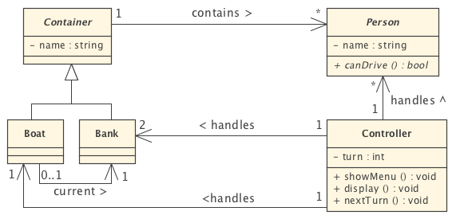

[](https://classroom.github.com/a/-bI9yjd4)
# Laboratoire 3: Rivière

**Durée du laboratoire: 3 séances.** 

**Date de rendu: 23/05/2024 avant la séance de labo**

## 1. Introduction

Une famille composée d'un père, d’une mère, de deux filles et de deux garçons est accompagnée d'un policier et d'un voleur menotté. Ils doivent tous traverser une rivière à l'aide d'un bateau.

Contraintes devant être satisfaites en tout temps sur les deux rives et sur le bateau:
- Il ne peut y avoir que deux personnes au maximum sur le bateau.
- Les enfants et le voleur ne peuvent piloter le bateau (mais peuvent y monter lorsqu’il est à quai).
- Le voleur ne peut pas rester en contact avec un membre de la famille si le policier n'est pas présent.
- Les fils ne peuvent rester seuls avec leur mère si le père n’est pas présent.
- Les filles ne peuvent rester seules avec leur père si la mère n’est pas présente.

Le but du laboratoire est de créer une application en C++ en mode console permettant à l’utilisateur d’introduire les commandes pour embarquer et débarquer des personnes et déplacer le bateau.

##  2. Exemple d’exécution

Remarque: dans l’exemple ci-dessous la ligne de = symbolise la rivière.

```shell
1. Situation initiale:
p : afficher
e <nom>: embarquer <nom>
d <nom>: debarquer <nom>
m : deplacer bateau
r : reinitialiser
q : quitter
h : menu
----------------------------------------------------------
Gauche: pere mere paul pierre julie jeanne policier voleur
----------------------------------------------------------
Bateau: < >
==========================================================
----------------------------------------------------------
Droite:
----------------------------------------------------------
2. Etats après les commandes « e voleur », « e pere », « e policier », « m » et « d policier »:
0> e voleur
----------------------------------------------------------
Gauche: pere mere paul pierre julie jeanne policier
----------------------------------------------------------
Bateau: < voleur >
==========================================================
----------------------------------------------------------
Droite:
----------------------------------------------------------
1> e pere
### garcon avec sa mere sans son pere
2> e policier
-----------------------------------------------------------
Gauche: mere paul pierre julie jeanne pere
-----------------------------------------------------------
Bateau: < voleur policier >
===========================================================
-----------------------------------------------------------
Droite:
-----------------------------------------------------------
3> m
-----------------------------------------------------------
Gauche: mere paul pierre julie jeanne pere
-----------------------------------------------------------
===========================================================
Bateau: < voleur policier >
-----------------------------------------------------------
Droite:
-----------------------------------------------------------
4> d policier
-----------------------------------------------------------
Gauche: mere paul pierre julie jeanne pere
-----------------------------------------------------------
===========================================================
Bateau: < voleur >
-----------------------------------------------------------
Droite: policier
-----------------------------------------------------------

```

## 3. Mise en oeuvre

Modéliser le problème en utilisant une approche POO, par exemple en s’inspirant du diagramme de classes incomplet ci-dessous (en y adjoignant les sous-classes, attributs et méthodes nécessaires). En particulier, il est important de bien factoriser le code produit et de ne pas compromettre l’encapsulation des données.



## 4. Annexe: STL

Afin de ne pas réinventer la roue il est possible d’utiliser les classes de la STL (Standard Template Library).

#### 4.1 Classe `std::string` (cf. http://www.cppreference.com/cppstring.html)
Définie dans l’en-tête `<string>`. Fonctionnalités analogues à celles définies dans le laboratoire précédent.

#### 4.2 Classe `std::list` (cf. http://www.cppreference.com/cpplist.html)
Définie dans l’en-tête `<list>`.

Cette classe générique permet de créer des listes doublement chaînées d’un type donné. Par exemple,
- définition d’une liste d’entiers: `std::list<int> listeEntiers;`
- définition d’une liste de pointeurs sur des voitures: `std::list<Voiture*> listeVoitures;`

Méthodes usuelles
- `push_back(value)` et `push_front(value)`:  ajoute un élément `value` à la fin ou au début de la liste, respectivement.
- `pop_back()` et `pop_front()`: supprime le dernier élément ou le premier élément de la liste, respectivement.
- `emplace_back(args...)` et `emplace_front(args...)`: Construisent un élément "in situ" à la fin ou au début de la liste, éliminant le besoin de copies ou de déplacements supplémentaires.
- `remove(valeur)`: supprime tous les éléments de la liste qui sont équivalents à value.
- `erase_if(predicat)`: supprime tous les éléments de la liste `lst` qui satisfont le prédicat. Par exemple, si lst est une std::list<int> appeler `lst.erase_if([](int x) { return x % 2 != 0; })` supprime tous les éléments impairs.
- `size()`: nombre d’éléments actuellement stockés dans la liste.
- `begin()` et `end()`: retourne des itérateurs bidirectionels (https://en.cppreference.com/w/cpp/iterator/bidirectional_iterator) qui pointent sur le premier élément de la liste et à une position théorique après le dernier élément, respectivement.

#### 4.3  Itérateurs (cf. http://www.cppreference.com/iterators.html)

A chacune des collections définie dans la STL est associé un type d’itérateur permettant de la parcourir.
Par exemple,
- itérateur sur la liste d’entiers: `list<int>::iterator it = listeEntiers.begin();`

Opérateurs usuels:
- les opérateurs `++` et `--` permettent de passer à l’élément suivant ou précédent dans la liste. *Note:* l'opérateur `--` n'existe que si l'itérateur est (au moins) bidirectionel. 
- l’élément courant dans la collection est obtenu en déréférençant l’itérateur (`*it`).
- la position d’un itérateur dans la collection peut être comparée avec celle d’un autre par les opérateurs
`==` et `!=` (p.ex. `it == listeEntiers.end()`).

#### 4.4 Fonction `std::find`
Définie dans l’en-tête `<algorithm>`.

La fonction `std::find(debut, fin, valeur)` permet de rechercher un élément dans une collection où, `debut`
et `fin` sont des itérateurs et `valeur` est l’élément recherché. Elle rend un itérateur positionné sur le premier
élément correspondant dans la collection ou sur la fin de la collection (définie par la méthode end() de la
collection) si l'élément n'est pas présent dans la liste.

Exemple:

```c++
// Définition et initialisation partielle d'une liste de chaînes de caractères
std::list<std::string> l = {"un", "deux"};

// Ajout d'un élément à la fin de la liste
l.push_back("trois");

// Parcours de la liste avec une boucle basée sur la portée
for (const auto& item : l) {
    std::cout << item << " ";
}
std::cout << std::endl;

// Suppression d'un élément
l.remove("deux");

// recherche d'un élément
if (std::find(l.begin(), l.end(), "deux") == l.end())
{
  std::cout << "La liste ne contient plus d'élément \"deux\"" << std::endl;
}
```


